

# QSnippet Screenshots

QSnippet ships with several built-in themes. A look at the homepage, snippet editor, and settings dialog in each.

[< Back to README](README.md#screenshots)

## Light

<table>
  <tr>
    <td align="center">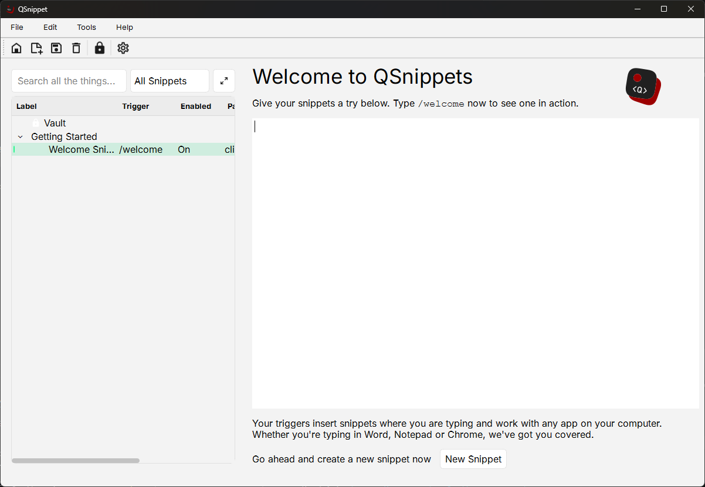 Homepage</td>
    <td align="center">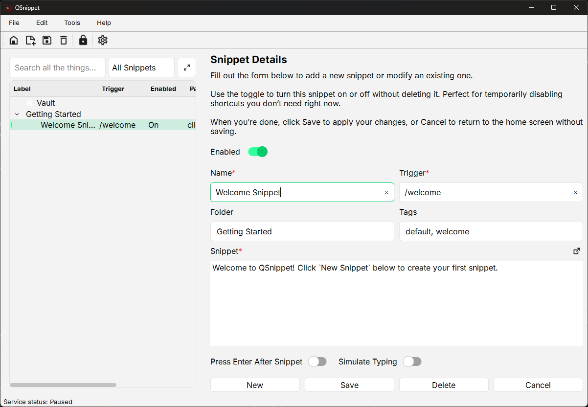 Snippet Form</td>
    <td align="center">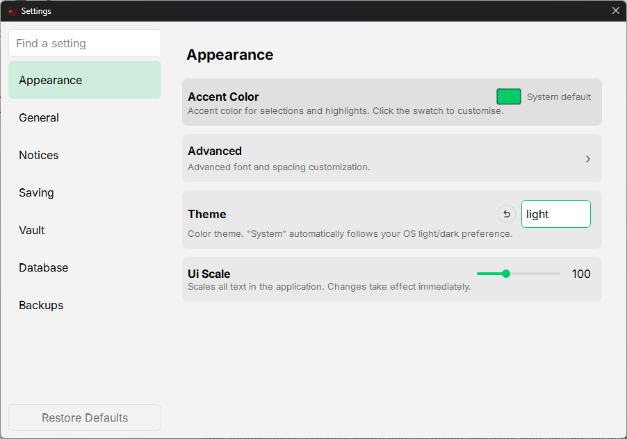 Settings</td>
  </tr>
</table>

## Dark

<table>
  <tr>
    <td align="center">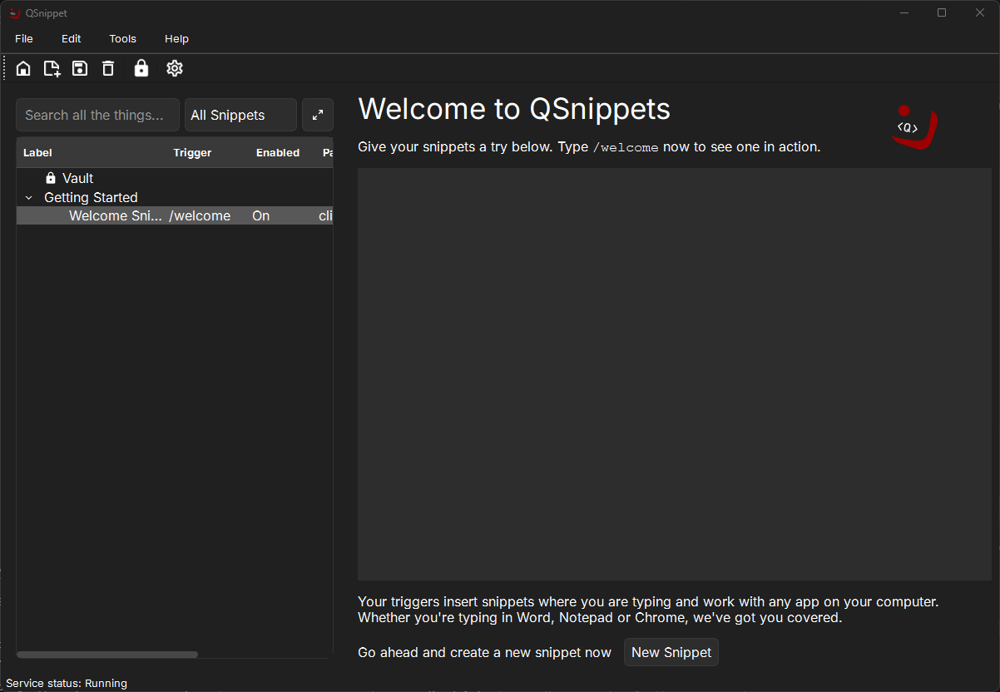 Homepage</td>
    <td align="center">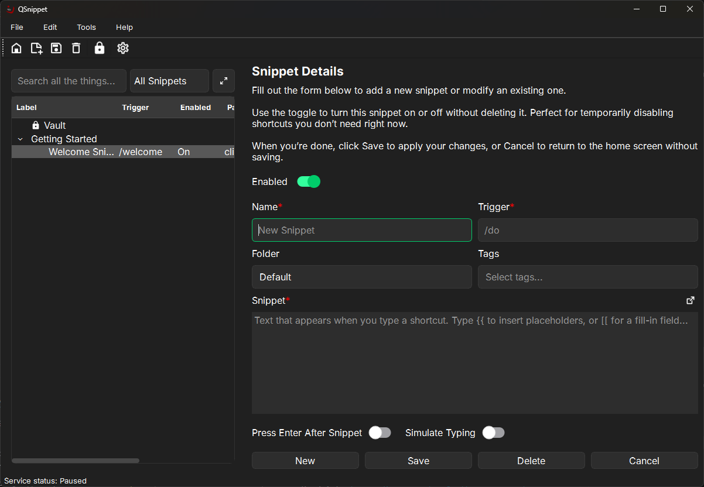 Snippet Form</td>
    <td align="center">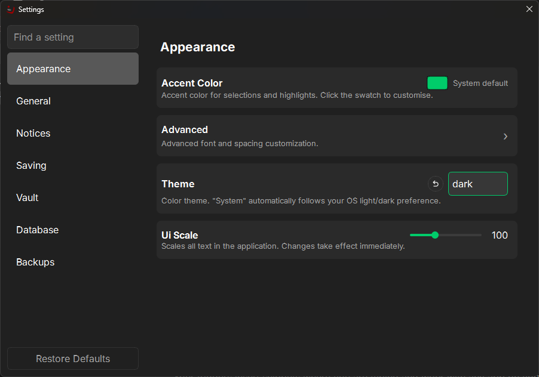 Settings</td>
  </tr>
</table>

## Nord

<table>
  <tr>
    <td align="center">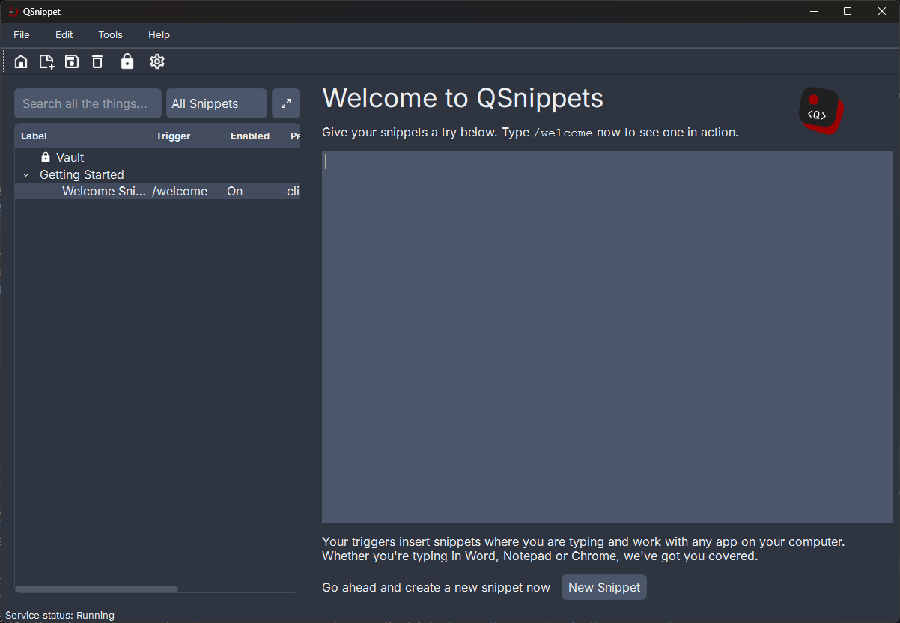 Homepage</td>
    <td align="center">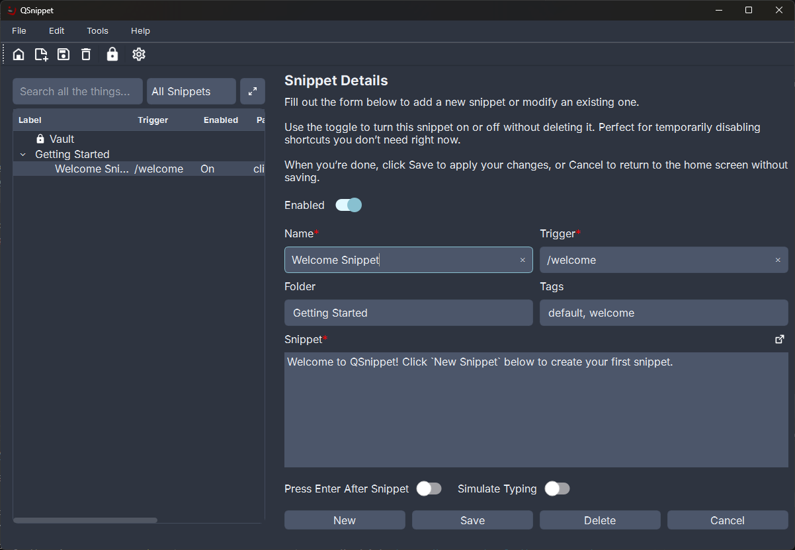 Snippet Form</td>
    <td align="center">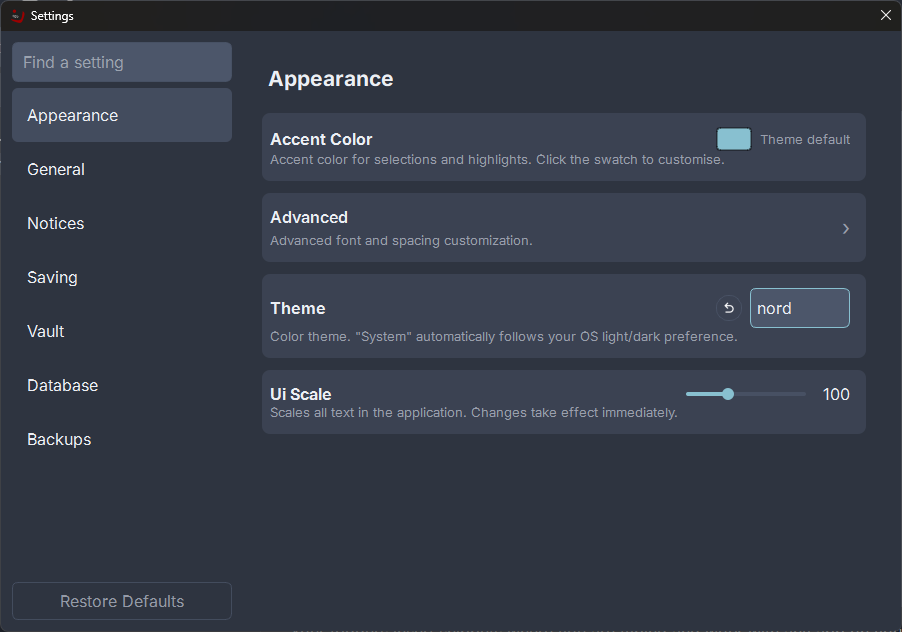 Settings</td>
  </tr>
</table>

## Pink

<table>
  <tr>
    <td align="center">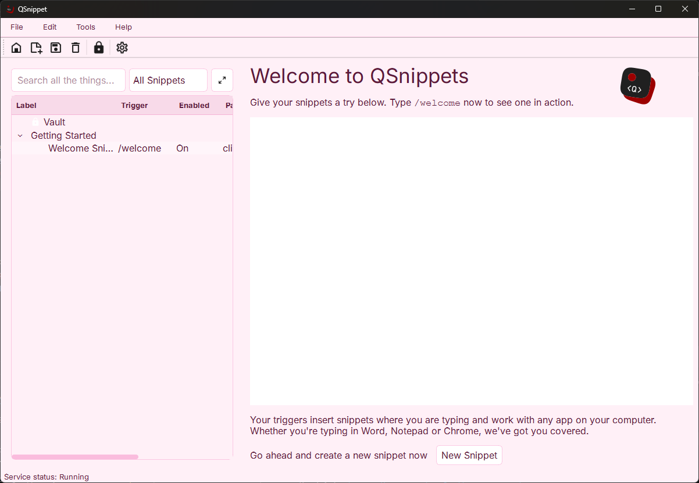 Homepage</td>
    <td align="center">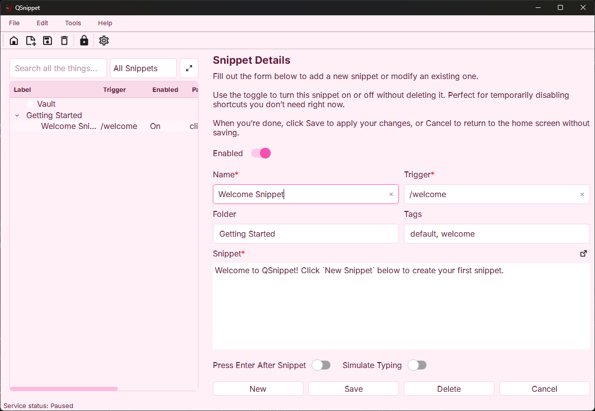 Snippet Form</td>
    <td align="center">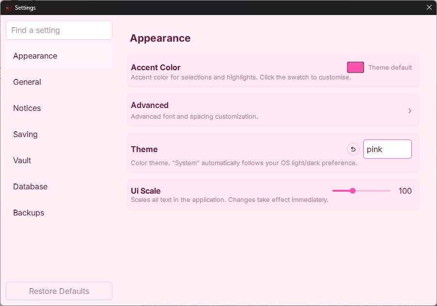 Settings</td>
  </tr>
</table>
